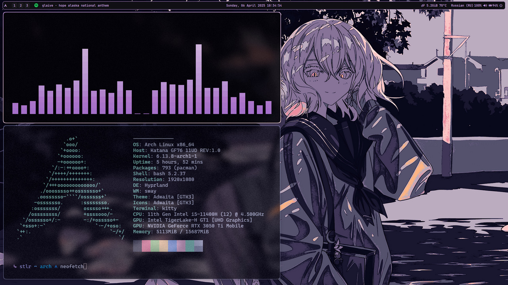

# arch-hyprland-dots


Мой кастомный конфиг под **Arch Linux + Hyprland**.  
Сейчас в розовом стиле, но планирую постепенно расширять функциональность, добавить автоматизацию, смену тем и дополнительные настройки.



## 📦 Что включено

- `Hyprland` — основной WM
- `hyprland.conf` + `hyprlock.conf`
- `waybar` — статус-бар
- `kitty` — терминал
- `rofi` — лаунчер (дефолтный, просто выбрана другая тема из стандартных)
- `cava` — аудио-визуализатор в терминале
- Обои в `.config/Wallpapers`
- Курсор: [`bibata-cursor-theme`](https://aur.archlinux.org/packages/bibata-cursor-theme)

## 🛠️ Что нужно установить вручную

```bash
sudo pacman -S waybar rofi wlogout hyprlock cava swaybg
yay -S grimblast-git bibata-cursor-theme
sudo pacman -S ttf-jetbrains-mono ttf-jetbrains-mono-nerd ttf-cascadia-code-nerd ttf-font-awesome
```

## ⚠️ Что нужно настроить под себя

- **Браузер**: в переменной выбран `Zen Browser` — если используешь другой, замени его в конфиге.
    
- **Мониторы**: перед использованием необходимо настроить параметры монитора в Hyprland.
    
- **Waybar → сеть**: в `config.jsonc` укажи своё сетевое подключение:
    
    ```jsonc
    "network": {
      "interval": 3,
      "interface": "enp3s0", // <-- замени на своё
      "format-ethernet": " ",
      "format-wifi": " {essid} {signalStrength}%",
      "format-disconnected": "Disconnected"
    }
    ```
    
- Если у тебя **нет батареи** (например, ПК), нужно вручную отключить блок отображения батареи в `waybar`.
    
- Конфиг ориентирован на **Pipewire** — для работы аудио виджета в `waybar`.
    

## 🧪 В планах

- Скрипты для автоматизации установки зависимостей и конфигов
    
- Удобная смена обоев через `swww`
    
- Полная кастомизация `rofi`
    
- Несколько тем (тёмная, темно-синяя и т. д.)