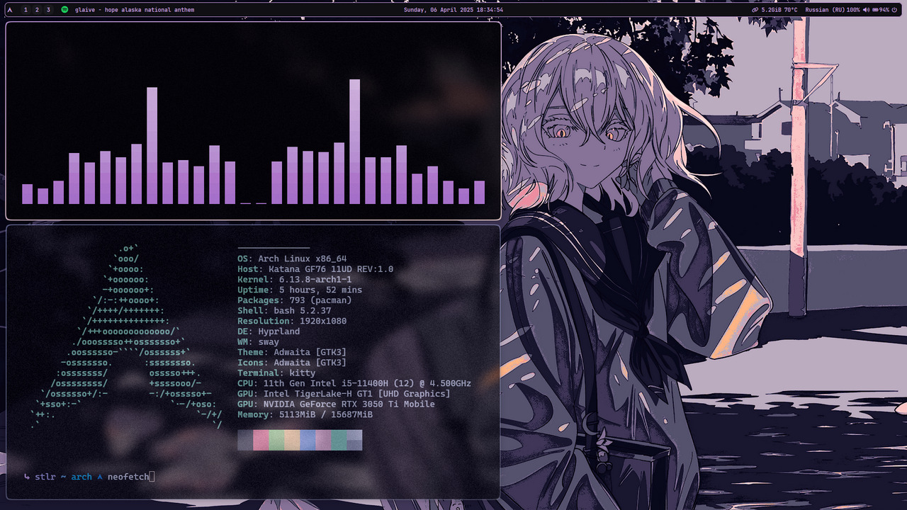
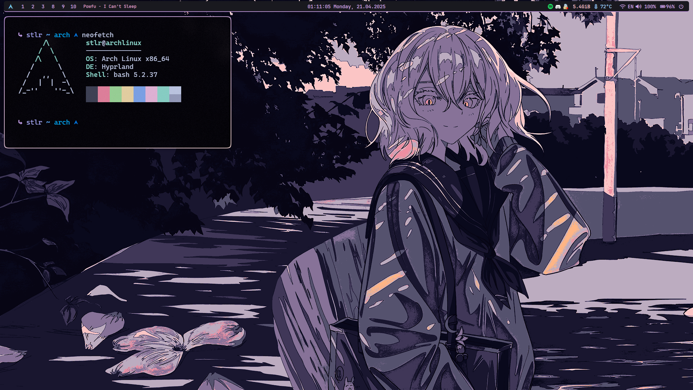
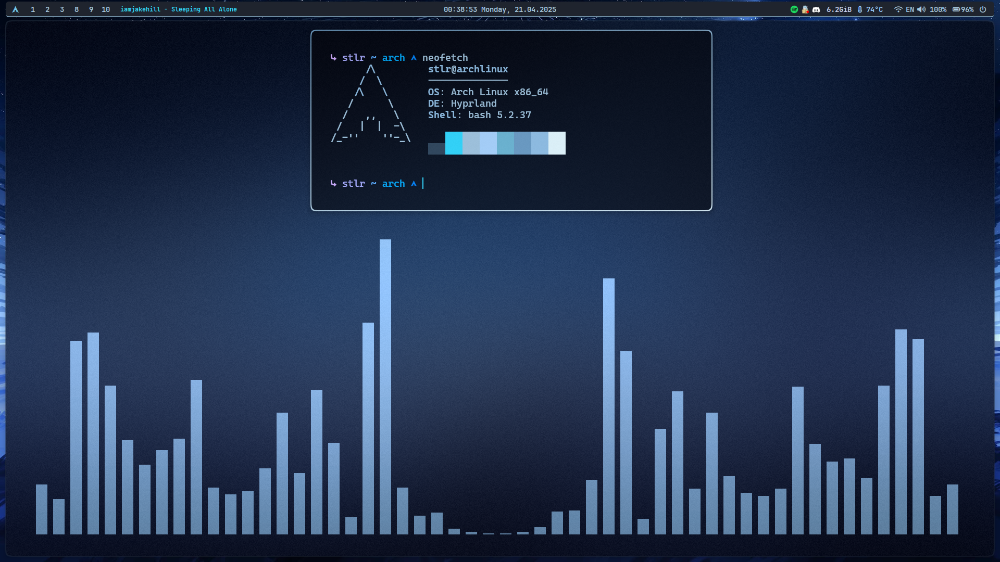
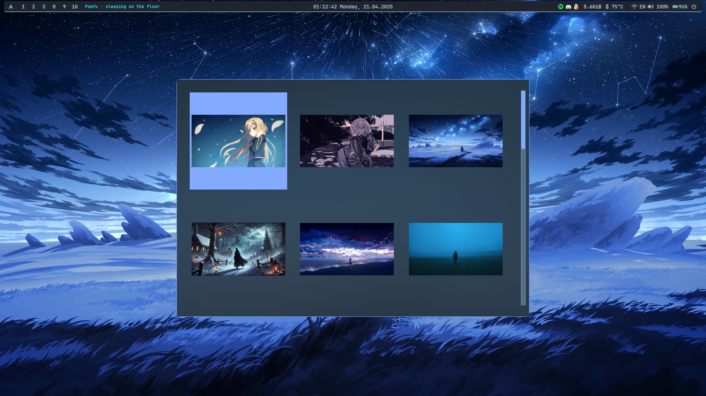

# arch-hyprland-dots

Мой кастомный конфиг под **Arch Linux + Hyprland**.

Сейчас он в двух темах — **pink** и новая **frost** — и постепенно расширяется: автоматизация обоев, улучшенный Waybar и директория обоев.

**Для тех, кто понимает, что делает.**
>В этом конфиге нет автоматизации установки — ты сам разбираешься, что и как ставишь, и как это должно работать.
  










  
## 📦 Что включено


- `Hyprland` — compositor

- `hyprland.conf` + `hyprlock.conf`

- `waybar` (обновлённый внешний вид)

- `kitty`

- `rofi` (кастомизация в планах, но настроен под wallpaper change с помощью вайбара)

- `cava`

- `neofetch` — маленький отдельный конфиг

- Директория с обоями: `.config/Wallpapers`

- Курсор: [`bibata-cursor-theme`](https://aur.archlinux.org/packages/bibata-cursor-theme)

  

## 🛠️ Что нужно установить вручную

  

```bash

sudo pacman -S waybar rofi wlogout hyprlock cava swww

yay -S grimblast-git bibata-cursor-theme

sudo pacman -S ttf-jetbrains-mono ttf-jetbrains-mono-nerd ttf-cascadia-code-nerd ttf-font-awesome

chmod +x ~/.config/waybar/wallpaper.sh

```

  

## ⚙️ Темы и переключение

  

В этой версии добавлена новая тема **frost**, сохранилась **pink**. Переключаются они вручную правкой `source`/`include`:

  

### Hyprland

В конце `~/.config/hypr/hyprland.conf` раскомментируй нужную строку:

```ini

# Раскомментируй нужный соурсник соответственно закомментировав старый:

source = themes/frost.css

# source = themes/pink.css

```

  

### Kitty

В `~/.config/kitty/kitty.conf` аналогично:

```conf

# include themes/pink.conf

include themes/frost.conf

```

  

### Waybar

В `~/.config/waybar/style.css`:

```css

/* @import "themes/pink.css"; */

@import "themes/frost.css";

```

  

### Cava

Цвета для cava вручную скопировать из файлов тем ~/.config/cava/config/themes и заменить в `~/.config/cava/config`.

  

## 🔄 Автоматизация в Waybar

  

- **Смена обоев**

- LКМ по иконке Arch → выбрать обои вручную

- ПКМ → следующие по списку из `.config/Wallpapers`

- **Звук**

- LКМ по модулю звука → mute/unmute

- ПКМ → открыть `pavucontrol`

  

## 🗂️ Neofetch

  

Добавлен небольшой конфиг для `neofetch` в `~/.config/neofetch/config.conf`.

  

## 📂 Директория обоев

  

`.config/Wallpapers/` — сюда складывайте картинки, они используются для автоматической смены через Waybar.

  

## 🎯 В планах

  

- Ещё пару тем

- Автоматическая смена тем с помощью waybar

- Кастомизация rofi