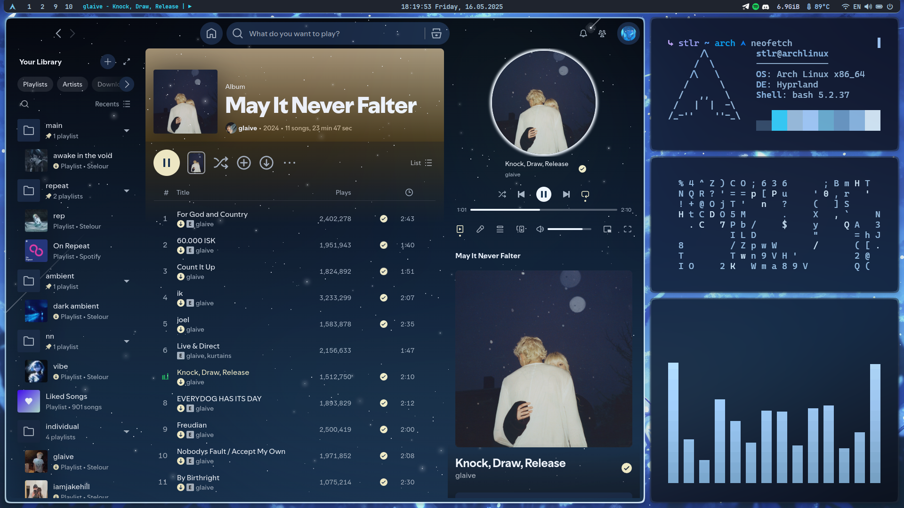

# arch-hyprland-dots

Personal configuration for **Arch Linux + Hyprland**.




## What’s Inside

- **Hyprland**  
  – `hyprland.conf` + `hyprlock.conf`  
- **Waybar**  
- **Kitty**  
- **Rofi**  
- **Cava**  
- **Neofetch**  
- **Dunst**  
- **Wallpapers**  

## Installation

```bash
# Pacman
sudo pacman -S waybar rofi hyprlock cava swww ttf-jetbrains-mono ttf-jetbrains-mono-nerd ttf-cascadia-code-nerd ttf-font-awesome

# AUR
yay -S grimblast-git bibata-cursor-theme wlogout

# Make the wallpaper script executable
chmod +x ~/.config/waybar/wallpaper.sh
```

## Manual Configuration

1. **Browser**: Spicetify is configured to use `Zen Browser`. If you use a different browser, update it in the Spicetify config.
2. **Displays**: Set your monitor parameters in `hyprland.conf`.
3. **Network Interface (Waybar)**: In `~/.config/waybar/config.jsonc`:

   ```jsonc
   "network": {
     "interface": "enp3s0", // ← replace with your interface name
   }
   ```
4. **Battery**: If you’re on a desktop (no battery), disable the battery block in `waybar/config.jsonc`.
5. **Audio**: The config assumes Pipewire for the Waybar audio module.

## Themes & Switching

Two themes are available: **frost** and **pink**. Switch manually by editing the include/source lines:

### Hyprland

In `~/.config/hypr/hyprland.conf`:

```ini
# source = themes/pink.css
source = themes/frost.css
```

### Kitty

In `~/.config/kitty/kitty.conf`:

```conf
# include themes/pink.conf
include themes/frost.conf
```

### Waybar

In `~/.config/waybar/style.css`:

```css
/* @import "themes/pink.css"; */
@import "themes/frost.css";
```

### Cava

Copy the desired color settings from `~/.config/cava/config/themes/{pink,frost}` into `~/.config/cava/config`.

## Waybar Automation

* **Wallpaper Switching**

  * Left-click: open chooser (from `~/.config/Wallpapers/`)
  * Right-click: switch to next wallpaper
* **Volume**

  * Left-click: mute/unmute
  * Right-click: open `pavucontrol`

## Other

* **Cava, Neofetch, Kitty, Dunst**: all styled to match the overall theme

## TODO

* Additional ready-to-use themes
* Theme switching directly from Waybar
* Extended Rofi customization